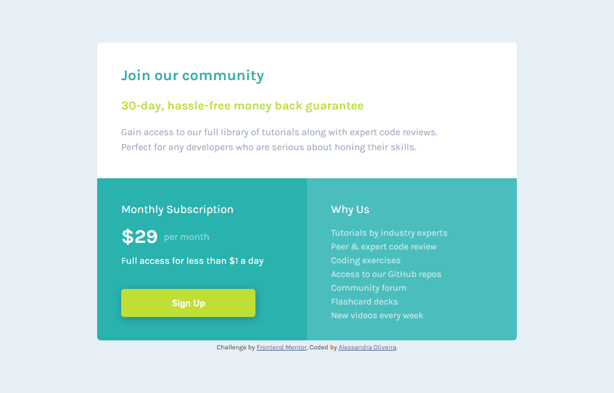

# Frontend Mentor - Single price grid component solution

This is a solution to the [Single price grid component challenge on Frontend Mentor](https://www.frontendmentor.io/challenges/single-price-grid-component-5ce41129d0ff452fec5abbbc). Frontend Mentor challenges help you improve your coding skills by building realistic projects. 

## Table of contents

- [Overview](#overview)
  - [The challenge](#the-challenge)
  - [Screenshot](#screenshot)
  - [Links](#links)
- [My process](#my-process)
  - [Built with](#built-with)
  - [Useful resources](#useful-resources)
- [Author](#author)

## Overview

This is a price component for a coding comunity. It has a description of how things work, the price and a sign up button. The project is 100% responsive so it will adapt to the size of the screen.

### The challenge

Users should be able to:

- View the optimal layout for the component depending on their device's screen size
- See a hover state and active state on desktop for the Sign Up call-to- and a active state on mobile.

### Screenshot

These are both desktop and mobile solutions

  

### Links

- Solution URL: [Add solution URL here](https://your-solution-url.com)

## My process

### Built with

- Semantic HTML5 markup
- CSS custom properties
- Flexbox
- CSS Grid

### Useful resources

- [Converting Colors](https://convertingcolors.com/) -  Particullarly I like to call the colors on my CSS code by its HEX code (not always the best choice though). This website converts the code for you from any format you have to any format you like. By now, it is my favorite.

## Author

- Frontend Mentor - [@itsale-o](https://www.frontendmentor.io/profile/itsale-o)
- LinkedIn - [alessandra-santos-oliveira](https://www.linkedin.com/in/alessandra-santos-oliveira/)
- Twitter - [@itsale_o](https://twitter.com/itsale_o)